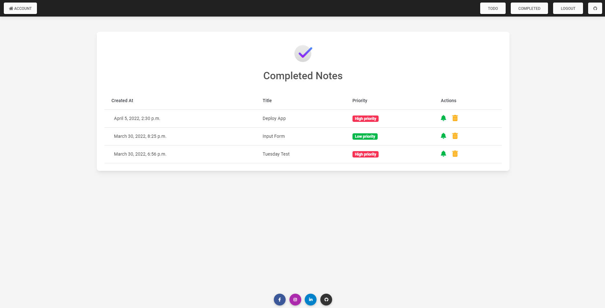
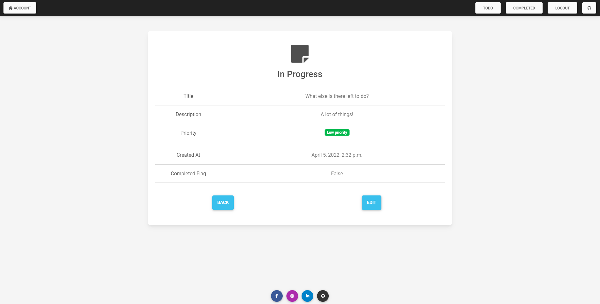

# Notes Application
My personal Notes Application built using Django, HTML, CSS, Bootstrap and JS.
 
Steps on how to use this project:
<ol> 
    <li>
    Pull repository
    </li>
    <li>
    Install packages from 'requirements.txt file' into virtual environment
    </li>
    <li>
    Change directory to 'notesapp' and run `python manage.py runserver`
    </li>
    <li>
    If needed open .env file and edit environment variables for your own email credentials
    </li>
    <li>
    Enjoy
    </li>
</ol>
 This project uses sqlite DB included in the repo. API was build using django rest framework and it uses json web tokens for authentication. UI was build from scratch using Bootstrap. 

<h3>Home Page

  

 

<h3>TODO Notes

  

 

<h3>Completed Notes

  

 

<h3>New Note Form

  

 

<h3>Single Note Edit

  

 

<h3>Login Page

  

 

<h3>API Endpoints</h3>

        {
            'GET': '/api/notes/'
            }, 
        {
            'GET': '/api/notes/id'
            }, 
        {
            'GET': '/api/profiles/'
            }, 
        {
            'POST': '/api/token/'
            }, 
        {
            'POST': '/api/token/refresh/'
            }
    
